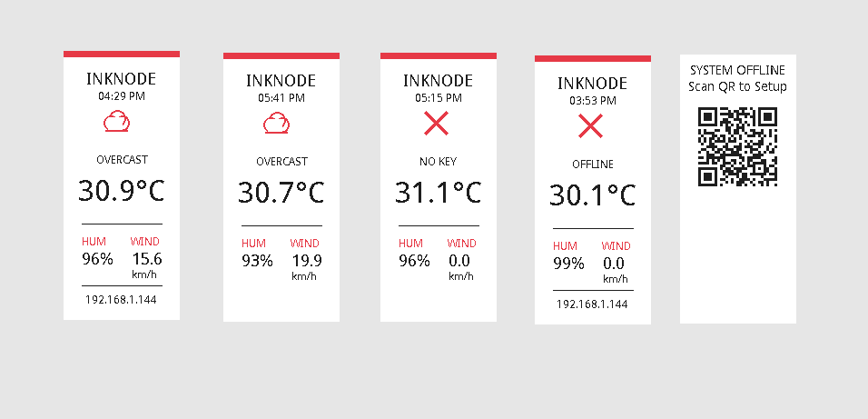
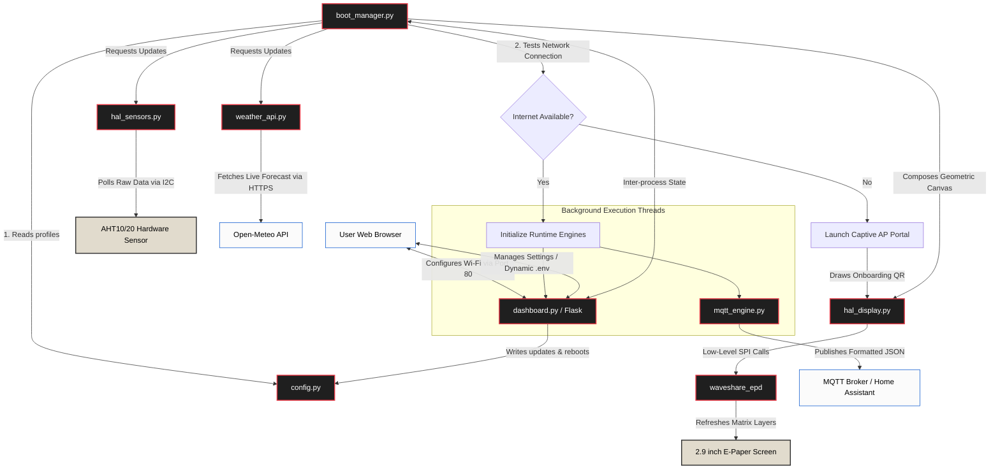
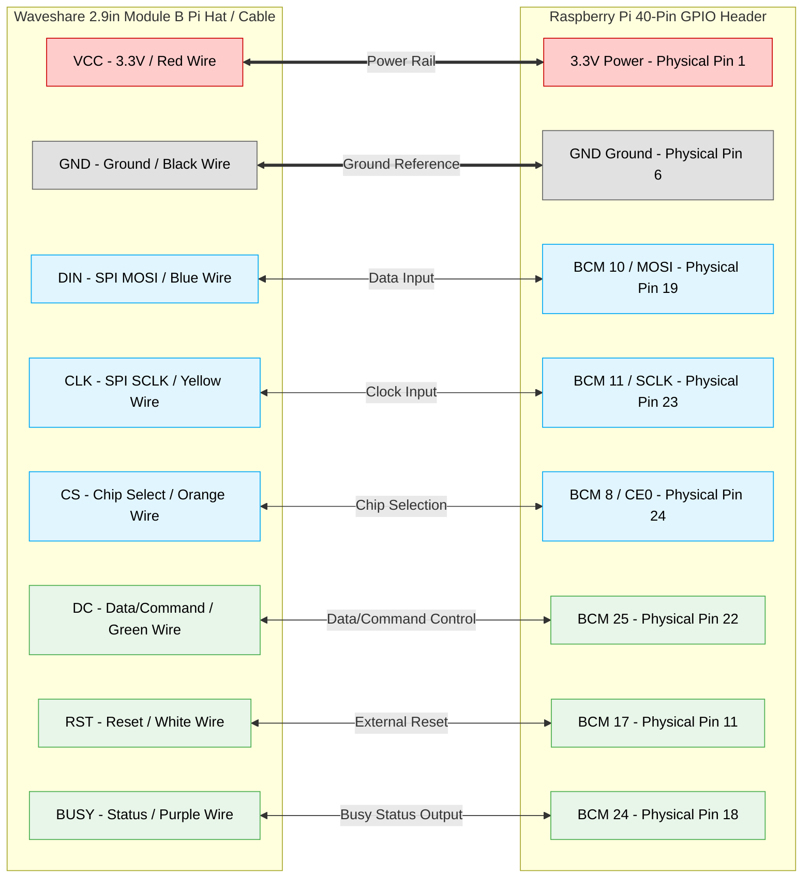

<div align="center">

[](https://www.gnu.org/licenses/agpl-3.0)
[](https://www.python.org/)
[](https://www.raspberrypi.org/)


<h3 align="center">A clean, distraction-free room climate monitor and home automation dashboard for the Raspberry Pi</h3>
</div>



## 📖 What is InkNode?

InkNode gives you complete visibility into your home environment without adding another glowing screen to your life. If you want smart home data on your desk or nightstand but are tired of bright backlights, InkNode is the solution. It is a self-contained appliance that reads local ambient conditions via hardware sensors, pulls outdoor forecasts, and displays them on a calm, paper-like electronic ink display.

Operating as an independent node, it provides a local web interface for effortless configuration and streams live telemetry directly to your existing home automation server over MQTT.

## ✨ Core Pillars of InkNode

To deliver a seamless and calm experience, InkNode is built on three main principles: Distraction-Free Design, Frictionless Setup, and Flexible Architecture.

### Distraction-Free Design
- **High-Contrast, Swiss-Style UI:** A borderless layout inspired by classic minimalist design prioritizes clean typography and readability.

- **Smart Color Layering:** Intentionally utilizes the e-paper's red ink for abstract weather icons and metric labels (`WIND`, `HUM`), preserving heavy black ink for critical data.


### Frictionless Setup (Zero Headaches)

- **Automated Headless Provisioning:** Forget about plugging in a monitor, keyboard, or manually editing configuration files on an SD card.

- **Captive Setup Portal:** If InkNode cannot reach the internet on boot, it automatically launches a temporary Wi-Fi Access Point and displays a QR code on the e-paper screen. Scan it, enter your credentials in the local web portal, and you are online.

- **Safe Rollbacks:** If a connection to your router fails, a background thread safely aborts and restores the setup portal so you are never locked out of your device.
    
### Flexible Architecture
- **Local Web Dashboard:** Tweak geographic coordinates, customize panel headers, or update MQTT broker targets directly from your browser.

- **Hot Reloading:** Saving changes automatically updates the system environment (`.env`) and restarts background loops immediately—no reboot required.

- **Hardware Agnostic (HAL):** Display and sensor logic are cleanly isolated. You can easily swap the default 2.9" Waveshare drivers or AHTx0 code to support alternative I2C sensors (like the BME280) or different display sizes.

- **Pre-Deployment Testing:** Test layout calculations and logic on your PC using mocked hardware states before deploying to a physical Raspberry Pi.

### 📡 Decoupled Hardware & Automation

-   **Hardware Agnostic (HAL):** The core display and sensor handling logic are cleanly isolated in `hal_display.py` and `hal_sensors.py`. You can easily swap out the default 2.9" Waveshare drivers or the AHTx0 code to support completely different display sizes or alternative I2C sensors (like the BME280 or DHT22).
    
-   **Pre-Deployment Testing:** Includes an independent test runner (`run_tests.py`) that uses mocked hardware states. This lets you test the layout calculations and application logic on a standard PC before deploying the code to a physical Pi.
    
## ⚙️ System Architecture: Under the Hood

InkNode manages simultaneous background processes while ensuring the UI remains responsive and independent of network or hardware delays.



## 🛠️ Hardware Specifications & Wiring

### What You Need

To build a standalone InkNode device, gather the following components:

1. **Raspberry Pi** Zero W or Zero 2W (ideal for a compact footprint).

2. **Waveshare 2.9" E-Paper Module:** Must be the Black/White/Red Tri-Color version.

3. **AHT25 or AHT20 Sensor:** I2C digital temperature and humidity module.

4. **MicroSD Card:** 8GB or larger running Raspberry Pi OS Lite (32/64-bit).

### Wiring Diagram

Connect your Waveshare 2.9inch e-Paper Module (B) to your Raspberry Pi using the physical SPI pin layout mapped below.

(For complete technical specifications, refer directly to the [Official Waveshare 2.9inch e-Paper Module (B) Manual.](https://www.waveshare.com/wiki/2.9inch_e-Paper_Module_(B)_Manual))



## 🚀 Getting Started

### 1. Enable Hardware Interfaces

Ensure the necessary hardware communication buses are active on your Raspberry Pi.

1. Run `sudo raspi-config` in your terminal.

2. Navigate to Interface Options.

3. Enable both `SPI` and `I2C`

### 2. Install and Execute

Clone the repository and run the setup script to install dependencies and configure the environment automatically.

```bash
git clone https://github.com/Ankitd013/InkNode.git
cd InkNode

chmod +x setup.sh
sudo ./setup.sh
```