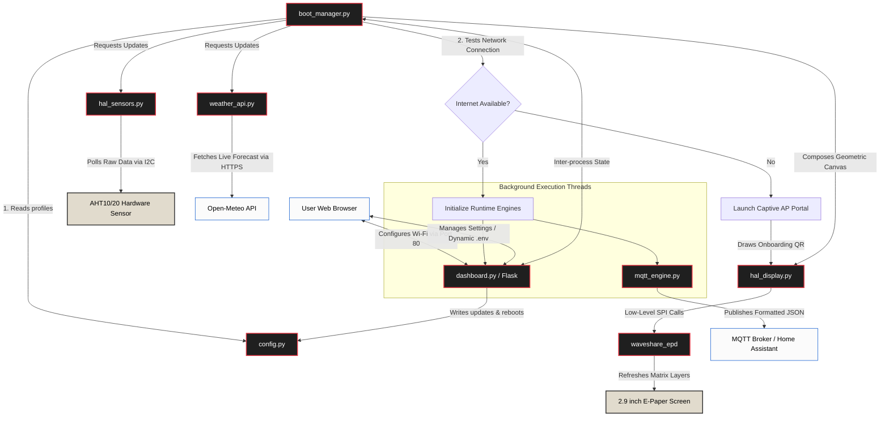
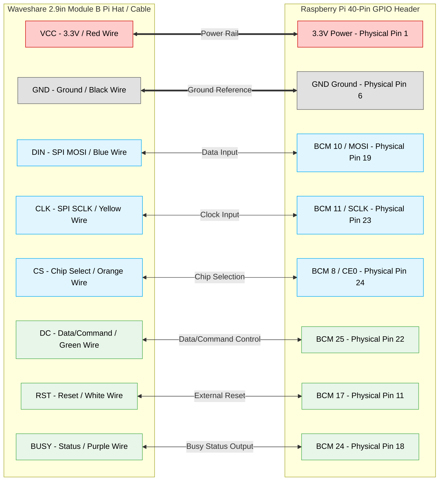

<div align="center">
  

# InkNode

**A clean, distraction-free room climate monitor and home automation dashboard for the Raspberry Pi.**

[](https://www.gnu.org/licenses/agpl-3.0)
[](https://www.python.org/)
[](https://www.raspberrypi.org/)

</div>

---

## 📖 What is InkNode?

InkNode is a self-contained smart home appliance that acts as a dedicated environment dashboard. It reads local ambient conditions using a precise hardware sensor, pulls outdoor forecasts, and displays them on a paper-like electronic ink display. 

With no bright backlights or glowing screens, it fits comfortably on a desk or nightstand. Under the hood, it functions as an independent node in your smart home setup—running a local web interface for easy configuration and streaming live telemetry straight to your existing home automation server over MQTT.

---

## ⚙️ How It Works



## ✨ Core Features

### 🎨 Clean Swiss-Style UI

-   **High Contrast Hierarchy:** A borderless layout inspired by classic minimalist design principles, focusing entirely on clean typography.
    
-   **Smart Color Layering:** Uses the e-paper's red ink layer intentionally for abstract weather icons and metric labels (`WIND`, `HUM`), leaving heavy black ink for easy-to-read numbers.

### 🔌 Headless Wi-Fi Provisioning

-   **No Headaches on First Boot:** You don't need to plug in a monitor or keyboard, and you don't need to write configuration files to your SD card.
    
-   **Automated Setup Portal:** If InkNode cannot reach the internet on boot, it switches its Wi-Fi card into a temporary Access Point and displays a setup QR code on the e-paper screen. Scanning it opens a local web interface where you can securely type in your Wi-Fi credentials.
    
-   **Safe Rollback:** If the connection to your router fails, a background thread cleanly safely aborts and restores the setup portal so you aren't locked out.
    

### 📱 Local Web Dashboard

-   **Web UI Configuration:** Once connected to your local network, typing the device's IP address into a browser opens a clean dashboard.
    
-   **On-the-Fly Editing:** Tweak your geographic coordinates, set custom panel headers, or update your MQTT broker targets directly from your browser.
    
-   **Hot Reloading:** Saving changes automatically updates the system environment (`.env`) and restarts background loops immediately without needing a full system reboot.
    

### 📡 Decoupled Hardware & Automation

-   **Hardware Agnostic (HAL):** The core display and sensor handling logic are cleanly isolated in `hal_display.py` and `hal_sensors.py`. You can easily swap out the default 2.9" Waveshare drivers or the AHTx0 code to support completely different display sizes or alternative I2C sensors (like the BME280 or DHT22).
    
-   **Pre-Deployment Testing:** Includes an independent test runner (`run_tests.py`) that uses mocked hardware states. This lets you test the layout calculations and application logic on a standard PC before deploying the code to a physical Pi.
    

## 🛠️ Hardware Requirements

To build a standalone InkNode device, you will need:

1.  **Raspberry Pi** (Zero W or Zero 2 W are ideal for a compact footprint)
    
2.  **Waveshare 2.9" E-Paper Module** (Must be the Black/White/Red Tri-Color version)
    
3.  **AHT25 or AHT20 Sensor** (I2C digital temperature and humidity module)
    
4.  **MicroSD Card** (8GB or larger) running Raspberry Pi OS Lite (32/64-bit)

## 🛠️ Hardware Wiring

To assemble a standalone InkNode device, connect your **Waveshare 2.9inch e-Paper Module (B)** tri-color display to your Raspberry Pi using the physical SPI pin layout below. 

For complete technical specifications and hardware driver updates, refer directly to the [Official Waveshare 2.9inch e-Paper Module (B) Manual](https://www.waveshare.com/wiki/2.9inch_e-Paper_Module_(B)_Manual).



## 🚀 Getting Started

### 1. Prepare Your Interfaces

Make sure the necessary hardware communication buses are enabled. Run `sudo raspi-config`, navigate to **Interface Options**, and ensure both **SPI** and **I2C** are active.

### 2. Installation

Clone the repository to your Raspberry Pi and execute the included setup script:

```bash
git clone https://github.com/Ankitd013/InkNode.git
cd InkNode

chmod +x setup.sh
sudo ./setup.sh
```